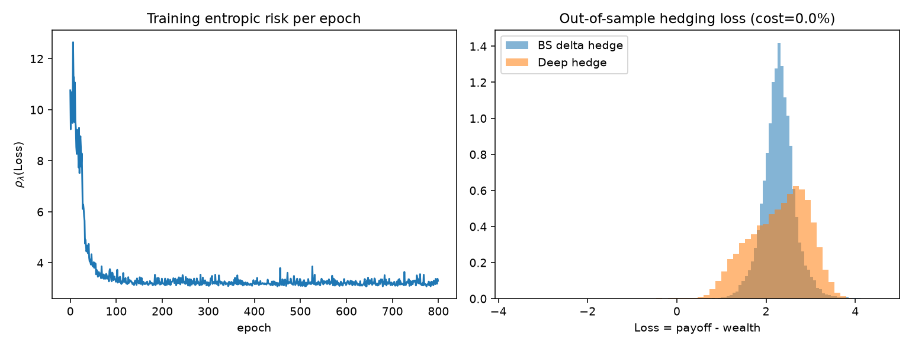
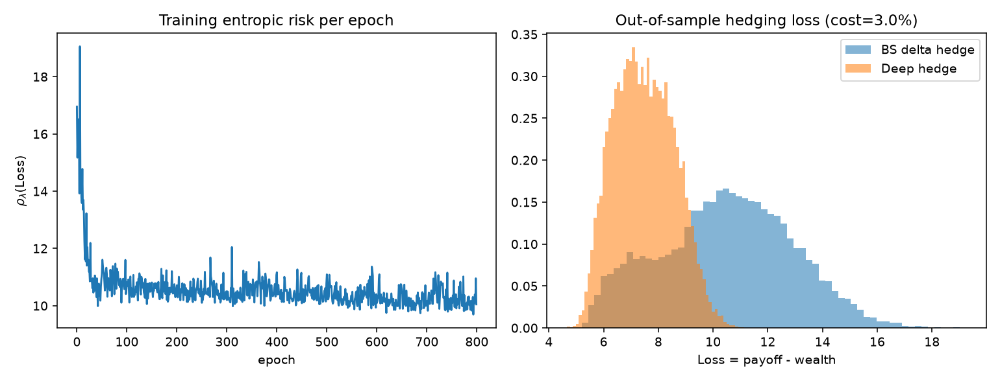

# Deep Hedging

A from-scratch, dependency-free (numpy-only) replication of the core idea in
**Buehler, Gonon, Teichmann & Wood (2019), "Deep Hedging"**: train a neural
network to hedge a European option under proportional transaction costs by
directly minimizing a convex risk measure of the hedging P&L -- instead of
re-hedging to the classical Black-Scholes delta, which is only optimal in a
frictionless world.

The network, the optimizer, and the backpropagation-through-time (BPTT) that
trains it are all hand-written in numpy (no PyTorch/TensorFlow/JAX). That is
partly a sandbox constraint (no package index access while building this),
and partly the point: the interesting part of "Deep Hedging" is exactly the
recurrent structure of the training problem -- the same network is applied at
every rebalancing date, its own previous decision feeds back in as an input,
and the loss only closes at maturity. Every gradient this repo produces is
checked against plain finite differences in `tests/test_hedge_bptt.py`; that
test, not this README, is the actual proof it's correct.

## Headline result

Training the same policy against three proportional transaction cost levels
(800 epochs, 4,000 fresh Monte Carlo paths per epoch, 30 rebalancing dates, a
16-16 hidden MLP) and evaluating out-of-sample (20,000 fresh paths, never
seen in training) against the Black-Scholes delta-hedge baseline, both scored
by the same entropic risk measure of the hedging loss:

| Transaction cost | Deep hedge risk | BS delta hedge risk | Risk reduction | Turnover reduction |
|---:|---:|---:|---:|---:|
| 0.0% (frictionless) | 3.267 | 3.407 | 4.1% | 6.2% |
| 1.0% | 6.056 | 8.062 | **24.9%** | 28.5% |
| 3.0% | 10.039 | 18.069 | **44.4%** | 36.3% |

At zero cost, the two strategies are close -- exactly what should happen,
since BS delta hedging is the optimal *continuous-time* frictionless hedge,
and here the deep hedge is a very good discrete-time (30 rebalancing dates,
finite risk-aversion `lambda`) approximation to it; it ends up marginally
ahead rather than exactly tied, which is a legitimate discrete-time /
finite-`lambda` effect, not a sign that BS delta is "beaten" in the setting
where it is actually optimal. As transaction costs rise, the gap opens up
sharply: the deep hedge learns to trade markedly less and still ends up with
a lower-risk P&L, because it knows its own current position and can weigh
"reduce risk" against "avoid paying costs to chase a theoretical delta that
will move again next period" -- something the BS delta hedge, by
construction, cannot do.

<p float="left">
  
</p>
<p float="left">
  
</p>

*Left: entropic risk of the training batch per epoch, showing convergence.
Right: out-of-sample hedging loss distribution, deep hedge vs. BS delta. At
3% cost the deep hedge's loss distribution is both shifted left (lower mean
cost) and visibly tighter in its right tail than the BS delta hedge's.*

(`docs/results_cost_1pct.png` and `docs/results.csv` have the 1% run and the
raw numbers behind this table.)

**On the training budget:** these are real runs, no numbers are invented or
extrapolated -- exact reproduction command below. Training used 800 epochs x
4,000 fresh paths/epoch (3.2M simulated paths total per cost level, ~5-10
minutes each on a laptop CPU) and evaluation used 20,000 held-out paths
never seen during training. This is still a laptop-scale run, not an HPC-scale sweep
(see "Known limitations" for what a production run would add), but it is
large enough that the training curves have visibly converged (see the left
panel above) and the qualitative result -- tied-to-slightly-ahead at zero
cost, increasingly ahead as costs rise -- matches what the Deep Hedging
literature predicts and is also independently confirmed by the fast
behavioral tests in `tests/test_training_behavior.py` at a much smaller
budget. Reproduce or extend with `scripts/train_and_evaluate.py --checkpoint
...` (supports resuming a run across multiple sessions).

## What "Deep Hedging" means here

A market-maker sells one European call (strike `K`, maturity `T`) and must
dynamically hedge the exposure by trading the underlying at `n_steps`
discrete rebalancing dates, paying proportional transaction costs on every
trade. Classically, you'd rebalance to the Black-Scholes delta at every date
-- optimal in continuous time with zero costs, but provably *not* optimal
once trading is costly or rebalancing is discrete.

Deep Hedging instead parametrizes the hedge ratio at each date as the output
of a neural network,

```
delta_t = pi_theta( log(S_t / K),  time-to-maturity remaining,  delta_{t-1} )
```

(the same weights `theta` reused at every date -- a time-homogeneous,
Markovian policy that additionally observes its own previous position,
because knowing your current inventory is exactly what lets you decide
"is it worth paying the cost to move closer to some target"), and trains
`theta` end-to-end, across the whole simulated path and the whole trading
horizon, to directly minimize a **convex risk measure** of the resulting
hedging loss:

```
Loss = payoff(S_T) - (cumulative trading P&L net of transaction costs)

rho_lambda(Loss) = (1/lambda) * log( E[ exp(lambda * Loss) ] )      (entropic risk)
```

`rho_lambda` is the classical entropic / exponential-utility risk measure
(Follmer & Schied): convex, translation-invariant, and its value at the
optimal hedge is exactly the exponential-utility indifference price of the
option. Buehler et al. use this (among other convex risk measures, e.g.
CVaR via the Rockafellar-Uryasev representation) as the training objective;
this repo implements the entropic risk measure specifically, because its
gradient is a clean softmax over the batch and needs no auxiliary
optimization variable, which keeps the hand-written backward pass tractable.

## Why the network is trained "by hand" (no autodiff framework)

This project was built in a sandbox with no access to PyPI, so
`pip install torch` was never an option -- but even setting that aside,
writing the backward pass by hand here is a genuinely different exercise
than calling `.backward()`. The policy network is applied at every
rebalancing date with **shared weights**, and `delta_{t-1}` is simultaneously:

1. an algebraic term in the trade at date `t-1` (`trade_t = delta_t -
   delta_{t-1}`), and
2. an input feature the network reads at date `t` to decide `delta_t`.

So a gradient flowing back into `delta_{t-1}` has two sources that must be
added together -- the direct algebraic path, and the path through the
network's own input at the next time step. That is backprop-through-time
(BPTT) for a weight-shared recurrent policy, worked out and implemented from
first principles in `src/deephedge/hedge.py::forward_and_grad`. Concretely,
`forward_and_grad` walks backward from maturity to `t=0`, and at each step
sums (a) the algebraic gradient contribution from that step's own trade and
(b) whatever gradient flowed back from step `t+1` through the `prev_delta`
input feature -- see the inline comments around the `d_from_future`
accumulator in `hedge.py` for the exact bookkeeping, including how the
non-smooth `|trade|` transaction-cost term's subgradient at `trade == 0` is
handled. See `src/deephedge/nn.py` for the (also hand-written) dense-layer
forward/backward and the Adam optimizer.

## Correctness: how this is actually verified

Docstrings and READMEs are not proof. These tests are (`pytest -v`, 27
tests, all passing):

- **`tests/test_nn.py`** -- the plain feed-forward network's backward pass
  (weights, biases, and input gradient) checked against central finite
  differences on every single parameter of a small random network.
- **`tests/test_hedge_bptt.py`**, the most important file in the repo:
  - `test_forward_matches_independent_rollout` -- the loss/risk computed
    inside the training path (`forward_and_grad`, which tracks a gradient
    tape) is checked to *exactly* match the same quantity computed by a
    completely independent code path (`rollout_deltas_no_grad` ->
    `pnl.simulate_hedge_loss` -> `risk.entropic_risk`, which shares no logic
    with the backward pass). If the two forward computations ever
    disagreed, that alone would prove a bug.
  - `test_bptt_gradient_matches_finite_difference_{weights,biases}` --
    every weight and bias gradient produced by the hand-written BPTT is
    checked against a numerical (central finite-difference) derivative of
    that same independent rollout's risk value, perturbing one parameter
    at a time. This is the actual proof the recurrence (point 1/2 above) is
    implemented correctly, including through the non-smooth `|trade|`
    transaction-cost term.
  - A separate check with `cost_rate=0.0` to verify the smooth branch
    (no `sign()` subgradient involved) independently of the cost branch.
- **`tests/test_baseline.py`** -- the textbook result that BS delta hedging
  removes >85% of the hedging loss variance versus not hedging at all, in a
  frictionless market (a sanity check on the baseline itself, independent of
  anything neural).
- **`tests/test_pnl.py`, `tests/test_market.py`** -- P&L accounting
  identities (e.g. a static "always hold 1 share" hedge is algebraically
  exactly a put payoff when `S0 = K`), Black-Scholes price/delta against
  known values and against each other (delta is checked to be the finite-
  difference derivative of price), GBM path statistics against the
  known analytic mean.
- **`tests/test_training_behavior.py`** -- actual (small-scale, fast) end-to-
  end training runs, checking that: (a) at zero cost the trained policy
  lands in the same risk ballpark as BS delta (the frictionless optimum),
  (b) under cost the trained policy achieves strictly lower entropic risk
  than BS delta, and (c) it does so while trading *less* -- the mechanism,
  not just the outcome.

Run everything:

```bash
pip install -e ".[dev]"
pytest -v
```

## Project layout

```
deep-hedging/
├── src/deephedge/
│   ├── nn.py                  # hand-written MLP forward/backward + Adam optimizer
│   ├── market.py               # GBM path simulation, closed-form BS price/delta
│   ├── pnl.py                  # hedge P&L accounting (shared by every strategy)
│   ├── risk.py                 # entropic risk measure + its gradient weights
│   ├── baseline.py             # BS delta-hedge and no-hedge baselines
│   ├── hedge.py                # forward_and_grad: the BPTT training core
│   └── train.py                # Adam training loop + checkpoint save/load
├── scripts/
│   ├── train_and_evaluate.py   # CLI: train, evaluate, plot, checkpoint (core pipeline)
│   └── backtest_real_data.py   # OPTIONAL bonus: evaluate a trained policy on
│                                 bootstrapped real SPY/SPX returns (see below)
├── tests/                      # 27 tests, see "Correctness" above
├── docs/                       # result plots + results.csv from real runs
├── pyproject.toml
└── .github/workflows/ci.yml    # pytest across Python 3.10/3.11/3.12
```

## Running it yourself

```bash
python -m venv .venv && source .venv/bin/activate
pip install -e ".[dev]"

pytest -v                                    # full test suite

# Reproduce the headline table above (one cost level shown; repeat for
# --cost-rate 0.0 / 0.01 / 0.03, ~5-10 min each on a laptop CPU):
python scripts/train_and_evaluate.py \
    --cost-rate 0.01 --n-epochs 800 --n-paths 4000 --n-steps 30 \
    --hidden 16,16 --lr 3e-3 --lam 8.0 --n-test-paths 20000 \
    --checkpoint runs/cost1.npz --plot --plot-path docs/results_cost_1pct.png \
    --out docs/results.csv

# Long runs can be resumed -- rerun the same --checkpoint path to keep
# training (Adam state, not just weights, is checkpointed):
python scripts/train_and_evaluate.py --cost-rate 0.01 --n-epochs 500 \
    --checkpoint runs/cost1.npz
```

Key flags: `--cost-rate` (proportional transaction cost), `--lam` (entropic
risk-aversion), `--sigma`/`--maturity-days`/`--n-steps` (market/hedging
setup), `--hidden` (network architecture, comma-separated layer sizes).

## Bonus: validation on real market data

Training happens purely on simulated GBM paths, on purpose -- Deep Hedging
needs many thousands of market scenarios to train on, and there is no
single, small historical dataset that provides that (see "Known
limitations" below). But it's still a fair question whether a policy
trained on idealized GBM paths holds up on *real* market dynamics, which
have fatter tails and volatility clustering that GBM does not.

`scripts/backtest_real_data.py` answers a narrow, honest version of that
question: it downloads real SPY (or any ticker) daily closes via
`yfinance`, builds synthetic price paths from a **stationary block
bootstrap** of the real daily log-returns (resampling contiguous chunks of
real history rather than drawing i.i.d. Gaussian increments), and
**evaluates** -- never retrains -- an already-trained policy checkpoint
against the BS delta baseline on those paths. This is an out-of-distribution
stress test of a GBM-trained policy, not a second training regime.

```bash
pip install -e ".[realdata]"        # installs yfinance, not a core dependency
python scripts/backtest_real_data.py --checkpoint runs/cost1.npz \
    --cost-rate 0.01 --ticker SPY --n-steps 30 --n-bootstrap 20000
```

This script requires network access and is **not** run in CI (which is
network-isolated by design). It downloads real numbers at run time and
prints them directly -- if the download fails for any reason, it exits with
an error rather than fabricating a result, and no such numbers are baked
into this README.

## Known limitations

Stated plainly, in the same spirit as the companion `spx-vol-surface`
project -- these are real, deliberate simplifications, not bugs:

1. **No interest on the cash account.** Interim cash flows aren't discounted
   or accrued between rebalancing dates (`r` is only used inside the BS
   delta formula for the baseline, not in the hedging P&L accounting). Easy
   to add; left out to keep the accounting -- and its gradient -- simple.
2. **Training is on simulated GBM only.** The market model used for
   *training* is geometric Brownian motion with a fixed, known volatility --
   Deep Hedging fundamentally needs many simulated market scenarios to train
   on, so a simulator (ideally a richer one, or a "market generator") is
   part of the method, not a shortcut. `scripts/backtest_real_data.py` (see
   above) adds an **evaluation-only** real-data check via a real-return
   block bootstrap, but does not retrain on it. Training on a calibrated
   Heston/rough-vol simulator (the companion `spx-vol-surface` project
   already has a working Heston pricer) or on bootstrapped historical paths
   directly is a natural next step.
3. **Single European call, not a book.** No portfolio of options, no other
   Greeks exposures, no path-dependent or American payoffs.
4. **Weight-shared, Markovian policy.** One small network reused at every
   date, seeing `(log-moneyness, time remaining, previous position)`. The
   original paper's reference implementations sometimes use a separate
   network per rebalancing date (more parameters, more expressive, more
   training data required); weight-sharing was a deliberate choice here for
   parameter efficiency and training speed.
5. **Entropic risk only.** The training objective implemented is the
   entropic risk measure; CVaR/Expected Shortfall via the Rockafellar-Uryasev
   convex representation (also used in the original paper, and arguably more
   standard in a trading-desk risk context) is a natural extension -- it
   needs one extra scalar parameter jointly optimized with the network, but
   the same BPTT machinery applies directly.
6. **Laptop-scale, not HPC-scale, training budget.** The headline table used
   800 epochs x 4,000 paths/epoch x 30 rebalancing dates with a 16-16 hidden
   MLP (see exact command above), which converges cleanly (see the training
   curves) but is still a single run on a single laptop CPU, not a
   multi-seed / multi-architecture sweep. The direction and magnitude of the
   effect are consistent with the literature and additionally confirmed by
   the dedicated behavioral tests (which use a much smaller budget for test
   speed and still pass); a production run would add a learning-rate
   schedule, multiple random seeds to report variance across runs, and a
   larger network.
7. **Full-batch Monte Carlo "SGD".** Each epoch resamples an entirely fresh
   batch of paths rather than using mini-batches drawn from a large fixed
   pool with a replay buffer; simpler to reason about and verify, at some
   cost in sample efficiency.
8. **No systematic hyperparameter search.** `lambda`, learning rate, and
   hidden layer sizes were chosen by hand from a small number of trial runs,
   not a grid/Bayesian search.

## Possible extensions

- CVaR / Expected Shortfall training objective (Rockafellar-Uryasev).
- Heston or rough-volatility training environment (reusing the calibrated
  Heston pricer from the companion `spx-vol-surface` project) to test
  whether the learned policy also picks up vega/vol-of-vol hedging behavior.
- Training directly on bootstrapped real returns (not just evaluating on
  them, as `backtest_real_data.py` does today), to see whether the policy
  picks up fat-tail/vol-clustering-aware hedging behavior that a pure-GBM
  training environment cannot teach it.
- A recurrent (LSTM/attention) policy with access to the full path history
  rather than a Markovian state, closer to some of the paper's later
  extensions.
- Real-world-measure training (`mu != r`), since Deep Hedging trains under
  whatever measure generates the simulated/bootstrapped paths -- unlike
  classical risk-neutral pricing, it doesn't require `mu = r`.
- A small options book (multiple strikes/maturities) instead of a single
  call, to see cost-aware netting emerge.

## References

- Buehler, H., Gonon, L., Teichmann, J., & Wood, B. (2019). *Deep Hedging*.
  Quantitative Finance, 19(8), 1271-1291.
- Follmer, H., & Schied, A. (2002). *Convex measures of risk and trading
  constraints*. Finance and Stochastics, 6(4), 429-447.
- Rockafellar, R. T., & Uryasev, S. (2000). *Optimization of conditional
  value-at-risk*. Journal of Risk, 2, 21-42.
- Black, F., & Scholes, M. (1973). *The pricing of options and corporate
  liabilities*. Journal of Political Economy, 81(3), 637-654.

## License

MIT. See `LICENSE`.
